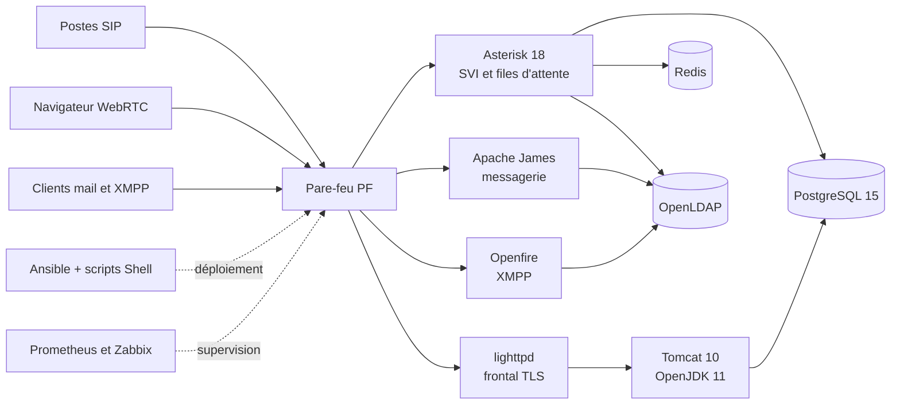
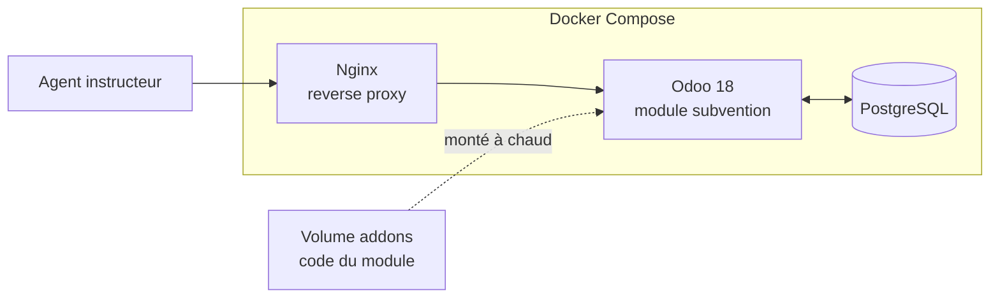
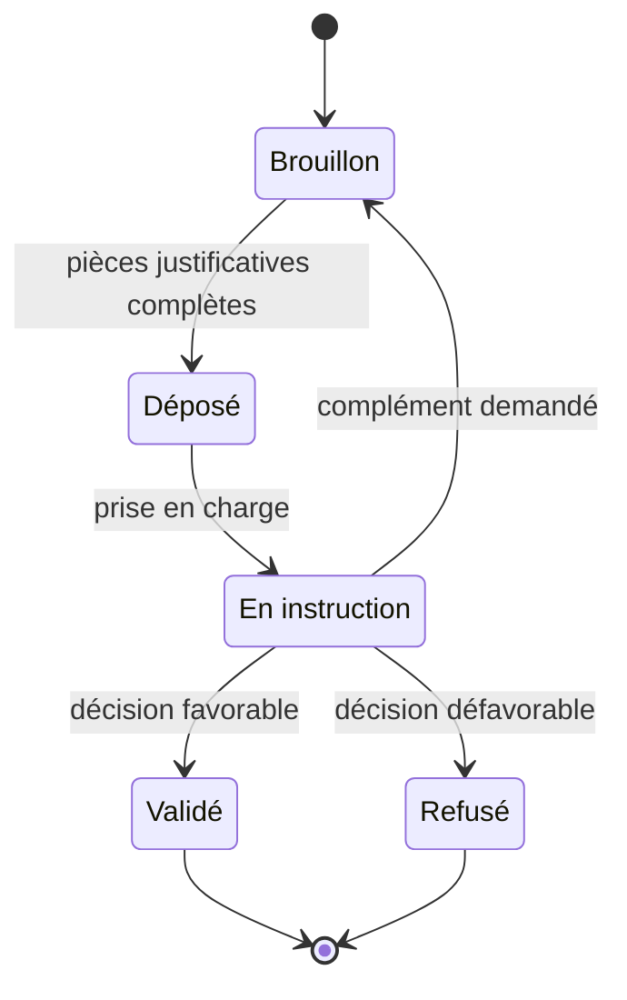
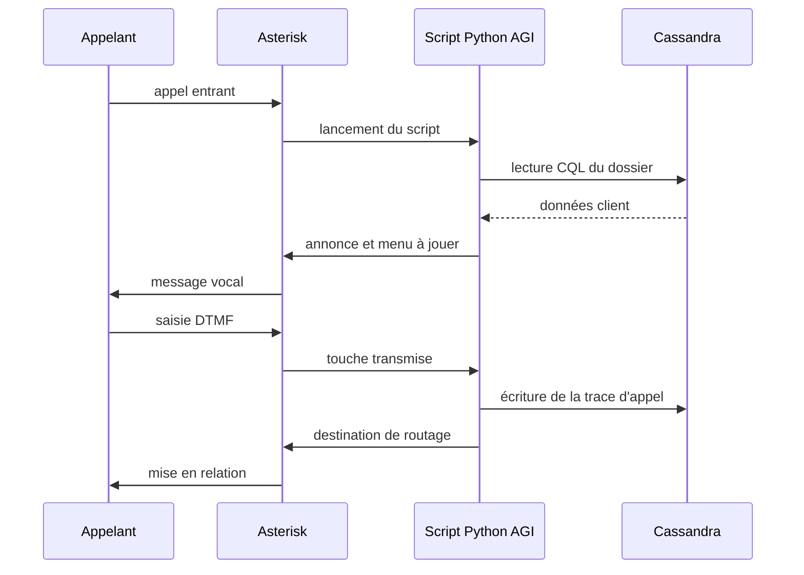
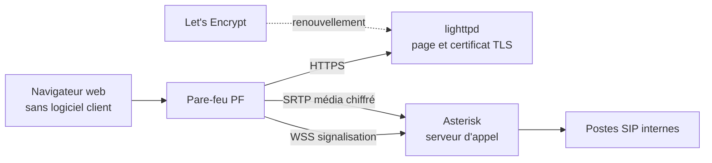
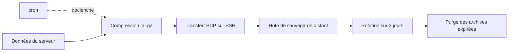

# Kendy JEROME

### Ingénieur Systèmes & Infrastructure
**Linux · FreeBSD · VoIP · Automatisation**

[-0A7B83?style=flat-square)](#)

**[Compétences](#ce-que-je-sais-faire) · [Projets](#projets) · [Méthode](#comment-je-travaille) · [Stack](#stack-technique) · [Parcours](#parcours) · [Contact](#me-contacter)**

---

> **Je construis des systèmes qui doivent tenir 24/7.**
> Infrastructures FreeBSD et Linux, téléphonie Asterisk, WebRTC chiffré, applications métier conteneurisées.
> De la maquette au service en production : je conçois, j'installe, j'automatise, je sécurise, je supervise.

---

## Ce que je sais faire

| Infrastructure & Systèmes | Communication & Temps réel | Exploitation & Sécurité |
|---|---|---|
| Serveurs FreeBSD, Linux, Windows Server en production | Architecture Asterisk : SVI, files d'attente, routage d'appel | Déploiement Infrastructure-as-Code avec Ansible et Shell |
| Virtualisation VMware, QEMU, VirtualBox, Docker | WebRTC navigateur avec chiffrement TLS/SRTP | Supervision Prometheus et Zabbix |
| Bases PostgreSQL, MySQL/MariaDB, Redis, Cassandra | Messagerie Apache James et XMPP Openfire | Réseau : VPN, DNS, VLAN, pare-feu PF et iptables |
| Frontaux Nginx, lighttpd, Tomcat sur OpenJDK | Annuaire AD/LDAP et administration des comptes | Support N2/N3 et procédures d'exploitation |

**Réseaux** : commutation, routage, VLAN, adressage — certifié Cisco CCNA.
**Applications métier** : développement de modules Odoo 18, conteneurisation Docker et Docker Compose.
**Documentation** : rédaction technique et procédures d'exploitation, pensées pour l'équipe qui reprend le service.

---

## Projets

### OpenWCC — Plateforme de centre de contacts open source

Conception et déploiement d'une plateforme de centre de contacts open source sous **FreeBSD 14**, montée service par service : téléphonie **Asterisk 18**, messagerie **Apache James**, messagerie instantanée **Openfire**, annuaire **OpenLDAP**, base **PostgreSQL 15**, cache **Redis**, conteneur applicatif **Tomcat 10** sur **OpenJDK 11**, frontal **lighttpd**, le tout derrière un pare-feu **PF**.

L'installation et la configuration de chaque brique sont industrialisées par playbooks **Ansible** et scripts **Shell** : la plateforme se redéploie intégralement sans intervention manuelle.

**Mon rôle sur la plateforme**

- Installation et configuration de l'ensemble des services, de l'OS au frontal web
- Automatisation des déploiements par Ansible et scripts Shell
- Administration des comptes utilisateurs et de l'annuaire AD/LDAP
- Services réseau : VPN, DNS, VLAN, règles de pare-feu
- Supervision des systèmes avec Prometheus et Zabbix
- Support de niveau 2 et 3, rédaction de la documentation technique et des procédures d'exploitation

`FreeBSD 14` · `Asterisk 18` · `PostgreSQL 15` · `Redis` · `OpenLDAP` · `Openfire` · `Apache James` · `Tomcat 10` · `OpenJDK 11` · `lighttpd` · `Python 3` · `PF` · `Ansible` · `Shell`

---

### Module Odoo 18 — Gestion des dossiers de subvention

**Le besoin.** Un dossier de subvention se monte à coups de tableurs et de pièces jointes éparpillées, sans trace fiable de qui a validé quoi ni de ce qui manque encore.

**La réponse.** Un module développé sur Odoo 18 qui fait du dossier un objet métier à part entière : un formulaire unique, des pièces justificatives rattachées, un circuit de validation explicite et un historique conservé. Le tout dans un environnement conteneurisé reproductible d'un poste à l'autre.

<table>
<tr><td width="50%" valign="top">

**Le module**

- Modèles de données déclarés via l'ORM Odoo
- Vues formulaire, liste et recherche en XML
- Circuit de validation par états
- Droits d'accès par groupe d'utilisateurs
- Documents justificatifs rattachés au dossier

</td><td width="50%" valign="top">

**L'environnement**

- Odoo 18 et PostgreSQL en services séparés
- Frontal Nginx en reverse proxy devant Odoo
- Orchestration par Docker Compose
- Addons montés en volume, rechargement à chaud
- Base persistée dans un volume nommé

</td></tr>
</table>

Cycle de vie d'un dossier :

`Odoo 18` · `Python` · `ORM Odoo` · `XML` · `Docker Compose` · `Nginx` · `PostgreSQL`

---

### SVI Python pour Asterisk

Serveur vocal interactif écrit en Python et branché sur Asterisk via AGI. Les données d'appel sont lues et écrites en CQL dans Cassandra, ce qui permet un routage décidé à l'exécution plutôt que codé en dur dans le dialplan.

Déroulé d'un appel :

`Python` · `Asterisk AGI` · `Cassandra` · `Redis`

---

### Infrastructure WebRTC chiffrée

Passerelle de communication temps réel permettant d'appeler depuis un simple navigateur, sans logiciel client. Signalisation en WebSocket sécurisé, flux média chiffrés en SRTP, certificats Let's Encrypt renouvelés automatiquement, le tout servi par Lighttpd sur FreeBSD.

`Asterisk` · `WebRTC` · `TLS/SRTP` · `Let's Encrypt` · `Lighttpd` · `FreeBSD`

---

### Sauvegarde automatisée à 3 niveaux

Chaîne de sauvegarde sans dépendance : compression tar.gz, transfert SCP vers un hôte distant, rotation sur deux jours et déclenchement par cron. Pensée pour tourner seule sur un serveur en production et rester lisible par le prochain administrateur.

`Shell` · `tar/gzip` · `SCP/SSH` · `cron` · `FreeBSD`

---

### Applications web

Des projets menés en parallèle pour rester à l'aise côté développement et déploiement continu.

| Projet | Description | Stack |
|---|---|---|
| **MiruStream** | Media center web : catalogue, lecture et déploiement continu | Next.js · Supabase · Vercel |
| **MiruStream API** | Backend REST qui alimente MiruStream, livré en conteneur | FastAPI · Python · Docker |
| **MiruList** | Suivi de catalogue et de progression avec interface web | JavaScript · Vercel |
| **Loup_G** | Jeu multijoueur en ligne | TypeScript · Vercel |

---

## Comment je travaille

Je passe par un playbook Ansible ou un script même quand l'installation à la main irait plus vite sur le moment. Une machine montée de mémoire, on ne la refait jamais deux fois pareil, et ça se paie le jour où il faut la remonter dans l'urgence. La plateforme OpenWCC se réinstalle de bout en bout sans que j'aie à me souvenir de quoi que ce soit.

Le pare-feu et les certificats arrivent en même temps que le service, jamais après. Ouvrir large en se disant qu'on refermera plus tard, ça finit en règles oubliées six mois plus tard.

Je documente au fur et à mesure, parce qu'un service finit toujours par changer de mains. Procédures d'exploitation, fichiers de configuration commentés, de quoi permettre à un collègue de reprendre sans venir me chercher.

Et je surveille. Prometheus et Zabbix pour les métriques, et des sauvegardes que je restaure vraiment de temps en temps. Une sauvegarde qu'on n'a jamais restaurée, on ne sait pas encore si c'en est une.

---

## Stack technique

<b>Voir la stack détaillée</b>

 

| Domaine | Technologies |
|---|---|
| **Systèmes** | FreeBSD 14 · Debian/Ubuntu · CentOS · Windows Server |
| **Virtualisation** | VMware · QEMU/KVM · VirtualBox · Docker · Docker Compose |
| **VoIP & temps réel** | Asterisk 18 · FreeSWITCH · WebRTC · SIP · SRTP |
| **Messagerie & annuaire** | Apache James · Openfire (XMPP) · OpenLDAP · AD |
| **Automatisation** | Ansible · Shell · Python 3 · Git · cron |
| **Bases de données** | PostgreSQL 15 · MySQL · MariaDB · Redis · Cassandra |
| **Web & applicatif** | Nginx · lighttpd · Tomcat 10 · OpenJDK 11 · Let's Encrypt |
| **Supervision** | Prometheus · Zabbix |
| **Réseau & sécurité** | Routage et commutation Cisco · VLAN · VPN · DNS · PF · iptables |
| **Cloud** | AWS · Azure · Vercel · Supabase |
| **Développement** | Python · Shell · JavaScript · TypeScript · Next.js · FastAPI |
| **ERP & métier** | Odoo (développement de modules) · Docker Compose · ORM Odoo · XML |

---

## Parcours

| Année | Diplôme ou certification | Établissement |
|---|---|---|
| 2023 – 2025 | **Mastère MPP** — Manager de Portefeuille de Projets, option Informatique | Keyce Academy |
| 2023 | **Licence professionnelle MRIT** — option Internet des Objets | Lycée Joseph Gaillard |
| — | **Certification CCNA** — réseaux Cisco | Cisco |
| 2022 | **BTS SN** — option Informatique et Réseaux | Lycée Joseph Gaillard |

---

## Me contacter

Je suis ouvert aux opportunités en **infrastructure, VoIP et DevOps**.
**Mobilité** : Martinique, Métropole et télétravail. Permis B, véhiculé.

 

*« Une infrastructure solide est invisible. On ne la remarque que le jour où elle manque. »*

